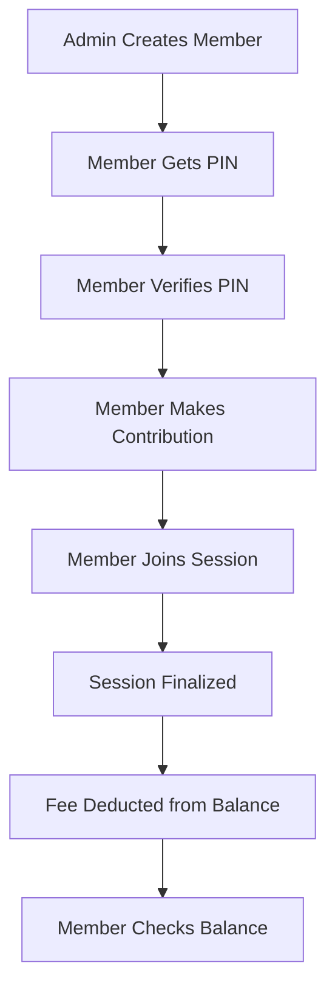
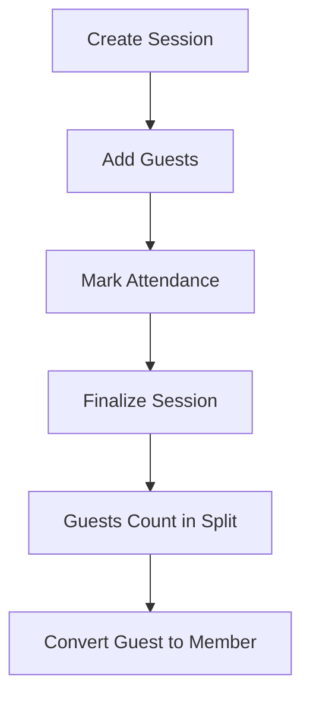
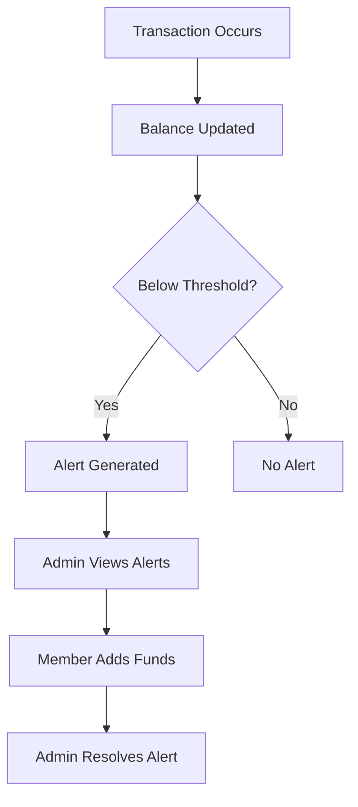

# API Workflows for Frontend Development

This document outlines complete user journeys with step-by-step API calls, request/response examples, and state management notes.

---

## Table of Contents
1. [Member Management Workflows](#member-management-workflows)
2. [Session Management Workflows](#session-management-workflows)
3. [Payment & Transaction Workflows](#payment--transaction-workflows)
4. [Alert & Notification Workflows](#alert--notification-workflows)
5. [Guest Management Workflows](#guest-management-workflows)
6. [Reports & Analytics Workflows](#reports--analytics-workflows)
7. [Settings Management Workflows](#settings-management-workflows)

---

## Member Management Workflows

### Workflow 1: Register New Member with PIN

**User Journey:** Admin creates a new member with office ID (PIN)

**Frontend Flow:**
```
Form Input → Validate → API Call → Update State → Show Success
```

**Step 1: Create Member**
```http
POST /members
Content-Type: application/json

{
  "name": "Alice Johnson",
  "contactNumber": "+8801712345678",
  "pin": "EMP001",
  "status": "active"
}
```

**Response:**
```json
{
  "id": 4,
  "name": "Alice Johnson",
  "pin": "EMP001",
  "contact_number": "+8801712345678",
  "balance": "0.00",
  "consecutive_absences": 0,
  "status": "active",
  "created_at": "2025-11-02T22:17:48.543Z",
  "updated_at": "2025-11-02T22:17:48.543Z"
}
```

**Frontend State Update:**
```typescript
// Add to members list
setMembers([...members, newMember]);
// Show success notification
showNotification('Member created successfully');
```

---

### Workflow 2: Member Login/Identification by PIN

**User Journey:** Member identifies themselves using PIN instead of selecting from list

**Frontend Flow:**
```
PIN Input → Verify → Show Member Info → Enable Actions
```

**Step 1: Verify PIN**
```http
POST /members/verify-pin
Content-Type: application/json

{
  "pin": "EMP001"
}
```

**Response:**
```json
{
  "id": 4,
  "name": "Alice Johnson",
  "pin": "EMP001",
  "balance": "250.00",
  "consecutive_absences": 0,
  "status": "active"
}
```

**Alternative: GET by PIN**
```http
GET /members/by-pin/EMP001
```

**Frontend State Update:**
```typescript
// Set current member
setCurrentMember(memberData);
// Enable member-specific actions
setIsAuthenticated(true);
```

**Error Handling:**
```typescript
// 404 - PIN not found
if (error.statusCode === 404) {
  showError('Invalid PIN. Please try again.');
}
```

---

### Workflow 3: View Member Balance & Transactions

**User Journey:** Member wants to see their current balance and transaction history

**Step 1: Get Member Details**
```http
GET /members/4
```

**Response:**
```json
{
  "id": 4,
  "name": "Alice Johnson",
  "balance": "250.50",
  "consecutive_absences": 0,
  "status": "active"
}
```

**Step 2: Get Transaction History**
```http
GET /members/4/transactions
```

**Response:**
```json
[
  {
    "id": 15,
    "transaction_type": "contribution",
    "amount": "500.00",
    "timestamp": "2025-11-01T10:00:00.000Z",
    "notes": "Monthly contribution"
  },
  {
    "id": 16,
    "transaction_type": "session_fee",
    "amount": "-84.25",
    "timestamp": "2025-11-02T18:00:00.000Z",
    "session": {
      "id": 3,
      "session_date": "2025-11-02"
    }
  }
]
```

**Frontend Display:**
```typescript
// Calculate summary
const totalContributions = transactions
  .filter(t => t.amount > 0)
  .reduce((sum, t) => sum + parseFloat(t.amount), 0);

const totalDeductions = transactions
  .filter(t => t.amount < 0)
  .reduce((sum, t) => sum + Math.abs(parseFloat(t.amount)), 0);
```

---

## Session Management Workflows

### Workflow 4: Create Session & Mark Attendance

**User Journey:** Admin creates a football session and marks who attended

**Frontend Flow:**
```
Create Session → Mark Attendance → On-field Payment (optional) → Finalize
```

**Step 1: Create Session**
```http
POST /sessions
Content-Type: application/json

{
  "sessionDate": "2025-11-03",
  "fieldId": 1,
  "categoryIds": [1, 2],
  "duration": 120,
  "notes": "Evening practice session"
}
```

**Response:**
```json
{
  "id": 5,
  "session_date": "2025-11-03T00:00:00.000Z",
  "field_id": 1,
  "duration": 120,
  "total_cost": "253.00",
  "status": "pending",
  "is_finalized": false
}
```

**Step 2: Mark Attendance (Bulk)**
```http
POST /sessions/5/attendance/bulk
Content-Type: application/json

{
  "attendanceRecords": [
    { "memberId": 1, "attendanceStatus": "present" },
    { "memberId": 2, "attendanceStatus": "present" },
    { "memberId": 3, "attendanceStatus": "absent" },
    { "memberId": 4, "attendanceStatus": "present" }
  ]
}
```

**Response:**
```json
{
  "message": "Attendance recorded for 4 members",
  "summary": {
    "present": 3,
    "absent": 1,
    "late": 0
  },
  "attendanceRecords": [...]
}
```

**Frontend State:**
```typescript
// Update session attendance count
setSession({
  ...session,
  presentCount: 3,
  absentCount: 1,
  attendanceMarked: true
});
```

**Step 3: Record On-field Payments (Optional)**
```http
POST /sessions/5/onfield-collection
Content-Type: application/json

{
  "payments": [
    { "memberId": 1, "amount": 100.00 },
    { "memberId": 2, "amount": 50.00 }
  ]
}
```

**Step 4: Finalize Session**
```http
POST /sessions/5/finalize
```

**Response:**
```json
{
  "message": "Session finalized successfully",
  "session": {
    "id": 5,
    "is_finalized": true,
    "total_cost": "253.00",
    "per_head_fee": "84.25"
  },
  "feesSplit": {
    "totalCost": 253.00,
    "attendees": 3,
    "perHeadFee": 84.25,
    "roundedFee": 84.25
  },
  "transactions": [
    {
      "id": 20,
      "member_id": 1,
      "amount": "-84.25",
      "transaction_type": "session_fee"
    },
    {
      "id": 21,
      "member_id": 2,
      "amount": "-84.25",
      "transaction_type": "session_fee"
    },
    {
      "id": 22,
      "member_id": 4,
      "amount": "-84.25",
      "transaction_type": "session_fee"
    }
  ]
}
```

**Frontend State:**
```typescript
// Update session status
setSession({
  ...session,
  is_finalized: true,
  per_head_fee: 84.25
});

// Update member balances
transactions.forEach(t => {
  updateMemberBalance(t.member_id, t.amount);
});

// Show success
showNotification('Session finalized! Fees split among 3 attendees.');
```

---

## Payment & Transaction Workflows

### Workflow 5: Member Makes Contribution

**User Journey:** Member adds money to their account

**Step 1: Add Contribution**
```http
POST /members/4/contributions
Content-Type: application/json

{
  "amount": 1000.00,
  "method": "mobile",
  "categoryId": 1,
  "reference": "TXN123456",
  "notes": "Paid via bKash"
}
```

**Response:**
```json
{
  "id": 25,
  "member_id": 4,
  "transaction_type": "contribution",
  "amount": "1000.00",
  "currency": "BDT",
  "method": "mobile",
  "category_id": 1,
  "reference": "TXN123456",
  "timestamp": "2025-11-03T10:30:00.000Z"
}
```

**Step 2: Get Updated Balance**
```http
GET /members/4
```

**Response:**
```json
{
  "id": 4,
  "name": "Alice Johnson",
  "balance": "1250.50",  // Was 250.50, now +1000
  "consecutive_absences": 0
}
```

**Frontend State:**
```typescript
// Update member balance
setMember({
  ...member,
  balance: parseFloat(member.balance) + amount
});

// Add to transaction history
setTransactions([newTransaction, ...transactions]);
```

---

### Workflow 6: Bulk Payment (Multiple Members Split)

**User Journey:** One person pays for multiple members (e.g., member pays for 3 people's session fees)

**🚧 COMING SOON - Phase 3**

**Planned API:**
```http
POST /transactions/bulk-payment
Content-Type: application/json

{
  "member_ids": [1, 2, 3],
  "total_amount": 3000.00,
  "split_type": "equal",
  "payment_provider": "bkash",
  "notes": "Paid for 3 members"
}
```

**Expected Response:**
```json
{
  "bulk_payment_group": "BULK-2025-11-03-001",
  "total_amount": 3000.00,
  "split_type": "equal",
  "per_member_amount": 1000.00,
  "transactions": [
    {
      "id": 30,
      "member_id": 1,
      "amount": "1000.00",
      "transaction_type": "bulk_payment",
      "bulk_payment_group": "BULK-2025-11-03-001"
    },
    // ... 2 more transactions
  ]
}
```

**Frontend Flow:**
```typescript
// 1. Select members (checkboxes)
const selectedMembers = [1, 2, 3];

// 2. Choose split type
const splitType = 'equal'; // or 'custom'

// 3. If custom, input amounts
if (splitType === 'custom') {
  const amounts = {
    1: 1000,
    2: 1500,
    3: 500
  };
}

// 4. Execute payment
await api.createBulkPayment({...});

// 5. Update all member balances
selectedMembers.forEach(memberId => {
  updateMemberBalance(memberId, amount);
});
```

---

## Alert & Notification Workflows

### Workflow 7: View and Resolve Alerts

**User Journey:** Admin checks system alerts and resolves them

**🚧 COMING SOON - Phase 2**

**Step 1: Get All Unresolved Alerts**
```http
GET /alerts/unresolved
```

**Expected Response:**
```json
[
  {
    "id": 5,
    "alert_type": "member_low_balance",
    "member_id": 3,
    "member": {
      "name": "Bob Smith",
      "balance": "200.00"
    },
    "message": "Member balance (200 BDT) below threshold (250 BDT)",
    "is_resolved": false,
    "triggered_at": "2025-11-03T15:00:00.000Z"
  },
  {
    "id": 6,
    "alert_type": "treasury_low",
    "message": "Treasury balance (4500 BDT) below threshold (5000 BDT)",
    "is_resolved": false,
    "triggered_at": "2025-11-03T16:00:00.000Z"
  }
]
```

**Step 2: Get Alerts for Specific Member**
```http
GET /alerts/member/3
```

**Step 3: Resolve Alert**
```http
POST /alerts/5/resolve
Content-Type: application/json

{
  "notes": "Member added contribution, balance now sufficient"
}
```

**Frontend Display:**
```typescript
// Group alerts by type
const alertsByType = {
  treasury_low: alerts.filter(a => a.alert_type === 'treasury_low'),
  member_low_balance: alerts.filter(a => a.alert_type === 'member_low_balance'),
  fine_applied: alerts.filter(a => a.alert_type === 'fine_applied'),
  consecutive_absence: alerts.filter(a => a.alert_type === 'consecutive_absence')
};

// Show badge with count
const unresolvedCount = alerts.filter(a => !a.is_resolved).length;
```

---

## Guest Management Workflows

### Workflow 8: Add Guest to Session & Convert to Member

**User Journey:** Member brings a guest to session, pays for them, later converts guest to member

**🚧 COMING SOON - Phase 2**

**Step 1: Add Guest to Session**
```http
POST /sessions/5/guests
Content-Type: application/json

{
  "name": "David Wilson",
  "contactNumber": "+8801812345678",
  "broughtByMemberId": 1,
  "paidByMemberId": 1,
  "amountPaid": 100.00
}
```

**Expected Response:**
```json
{
  "id": 3,
  "name": "David Wilson",
  "contact_number": "+8801812345678",
  "session_id": 5,
  "brought_by_member_id": 1,
  "paid_by_member_id": 1,
  "amount_paid": "100.00",
  "converted_to_member": false,
  "created_at": "2025-11-03T17:00:00.000Z"
}
```

**Step 2: List Guests for Session**
```http
GET /sessions/5/guests
```

**Step 3: Convert Guest to Member**
```http
POST /guests/3/convert-to-member
Content-Type: application/json

{
  "pin": "EMP005",
  "status": "active"
}
```

**Expected Response:**
```json
{
  "message": "Guest converted to member successfully",
  "guest": {
    "id": 3,
    "converted_to_member": true,
    "converted_member_id": 8
  },
  "member": {
    "id": 8,
    "name": "David Wilson",
    "contact_number": "+8801812345678",
    "pin": "EMP005",
    "balance": "100.00",  // Guest's payment credited
    "status": "active"
  }
}
```

**Frontend Flow:**
```typescript
// 1. In session detail, show "Add Guest" button
// 2. Form: guest name, contact, who brought them
// 3. Option: pay for guest (deducts from member's balance)
// 4. After session, show guest list with "Convert to Member" button
// 5. When converted, remove from guest list, add to member list
```

---

## Reports & Analytics Workflows

### Workflow 9: View Financial Reports

**User Journey:** Admin views team financial status and spending analysis

**Step 1: Team Balance Overview**
```http
GET /reports/team-balance
```

**Response:**
```json
{
  "teamBalance": -317.75,
  "totalMembers": 3,
  "positiveBalances": 0,
  "negativeBalances": 3,
  "averageBalance": -105.92
}
```

**Step 2: Spending by Category**
```http
GET /reports/spending-by-category?startDate=2025-11-01&endDate=2025-11-30
```

**Response:**
```json
[
  {
    "category_id": 1,
    "category_name": "Field Rental",
    "total_spent": "253.00",
    "transaction_count": 1
  },
  {
    "category_id": 2,
    "category_name": "Equipment",
    "total_spent": "150.00",
    "transaction_count": 3
  }
]
```

**Step 3: Session Costs**
```http
GET /reports/session-costs?startDate=2025-11-01&endDate=2025-11-30
```

**Response:**
```json
[
  {
    "session_id": 3,
    "session_date": "2025-11-02T00:00:00.000Z",
    "total_cost": "253.00",
    "attendees": 3,
    "per_head_fee": "84.25",
    "field_name": "Main Field"
  }
]
```

**Frontend Dashboard:**
```typescript
// Create charts
const spendingChart = {
  labels: spendingData.map(s => s.category_name),
  data: spendingData.map(s => parseFloat(s.total_spent))
};

// Show KPIs
const kpis = {
  teamBalance: formatCurrency(teamBalance),
  avgPerSession: totalSpent / sessionCount,
  membersInDebt: negativeBalances
};
```

---

## Settings Management Workflows

### Workflow 10: Configure System Settings

**User Journey:** Admin adjusts thresholds and system parameters

**Step 1: Get All Settings**
```http
GET /settings
```

**Response:**
```json
[
  {
    "key": "treasury_min_threshold",
    "value": "5000",
    "description": "Minimum treasury balance before alert (BDT)"
  },
  {
    "key": "member_min_threshold",
    "value": "250",
    "description": "Minimum member balance before alert (BDT)"
  },
  // ... 6 more settings
]
```

**Step 2: Update Fine Percentage**
```http
PUT /settings/fine_percentage
Content-Type: application/json

{
  "value": "25"
}
```

**Step 3: Get Single Setting Value**
```http
GET /settings/consecutive_absence_limit/value
```

**Response:**
```json
{
  "value": "2"
}
```

**Frontend Settings Page:**
```typescript
// Group settings by category
const settings = {
  financial: ['treasury_min_threshold', 'member_min_threshold', 'rounding_increment'],
  enforcement: ['fine_percentage', 'consecutive_absence_limit', 'new_member_surcharge'],
  membership: ['new_member_period_days'],
  system: ['currency']
};

// Update setting
const updateSetting = async (key, value) => {
  await api.put(`/settings/${key}`, { value });
  // Refresh settings
  await loadSettings();
  showNotification(`${key} updated to ${value}`);
};
```

---

## Complete User Journeys

### Journey A: New Member Complete Flow



**API Sequence:**
1. `POST /members` - Create member with PIN
2. `POST /members/verify-pin` - Member identifies themselves
3. `POST /members/{id}/contributions` - Add money
4. `POST /sessions/{id}/attendance/bulk` - Mark attendance
5. `POST /sessions/{id}/finalize` - Split fees
6. `GET /members/{id}` - Check new balance

### Journey B: Session with Guests Flow



**API Sequence:**
1. `POST /sessions` - Create session
2. `POST /sessions/{id}/guests` - Add guests
3. `POST /sessions/{id}/attendance/bulk` - Mark attendance
4. `POST /sessions/{id}/finalize` - Fee split includes guests
5. `POST /guests/{id}/convert-to-member` - Guest becomes member

### Journey C: Alert Handling Flow



**API Sequence:**
1. `POST /members/{id}/contributions` or `POST /sessions/{id}/finalize`
2. System checks thresholds (automatic)
3. `GET /alerts/unresolved` - Admin checks alerts
4. `POST /members/{id}/contributions` - Member adds funds
5. `POST /alerts/{id}/resolve` - Admin resolves alert

---

## Error Handling Guide

### Common Error Responses

**400 Bad Request**
```json
{
  "statusCode": 400,
  "message": "Validation failed",
  "errors": [
    "amount must be a positive number",
    "pin must be between 1 and 10 characters"
  ]
}
```

**404 Not Found**
```json
{
  "statusCode": 404,
  "message": "Member with ID 999 not found"
}
```

**409 Conflict**
```json
{
  "statusCode": 409,
  "message": "Session already finalized"
}
```

**500 Internal Server Error**
```json
{
  "statusCode": 500,
  "message": "Internal server error"
}
```

### Frontend Error Handling Pattern

```typescript
try {
  const response = await api.post('/members', memberData);
  // Success
  showNotification('Member created successfully');
  navigate(`/members/${response.id}`);
} catch (error) {
  if (error.statusCode === 400) {
    // Validation error
    setFormErrors(error.errors);
  } else if (error.statusCode === 404) {
    showError('Resource not found');
  } else if (error.statusCode === 409) {
    showError('Conflict: ' + error.message);
  } else {
    showError('An unexpected error occurred');
    console.error(error);
  }
}
```

---

## Frontend State Management Recommendations

### Key State Slices

```typescript
// Members State
interface MembersState {
  members: Member[];
  currentMember: Member | null;
  loading: boolean;
  error: string | null;
}

// Sessions State
interface SessionsState {
  sessions: Session[];
  currentSession: Session | null;
  attendance: Attendance[];
  guests: Guest[];
}

// Transactions State
interface TransactionsState {
  transactions: Transaction[];
  bulkPayments: BulkPayment[];
  filters: TransactionFilters;
}

// Alerts State
interface AlertsState {
  alerts: Alert[];
  unreadCount: number;
  filter: 'all' | 'unresolved' | 'treasury' | 'member';
}

// Settings State
interface SettingsState {
  settings: Record<string, string>;
  loading: boolean;
}
```

---

## Next Steps for Frontend Development

1. **Set up API Client**: Create typed API functions using fetch/axios
2. **State Management**: Implement Redux/Zustand with the state slices above
3. **Components**: Build reusable components for members, sessions, transactions
4. **Forms**: Create forms with validation matching backend DTOs
5. **Real-time Updates**: Consider WebSocket for alerts and balance updates
6. **Testing**: Test all workflows end-to-end

---

**Last Updated**: November 3, 2025  
**API Version**: 1.0  
**Total Endpoints**: 50+  
**Status**: Phase 1 Complete ✅ | Phase 2-4 In Progress 🚧
